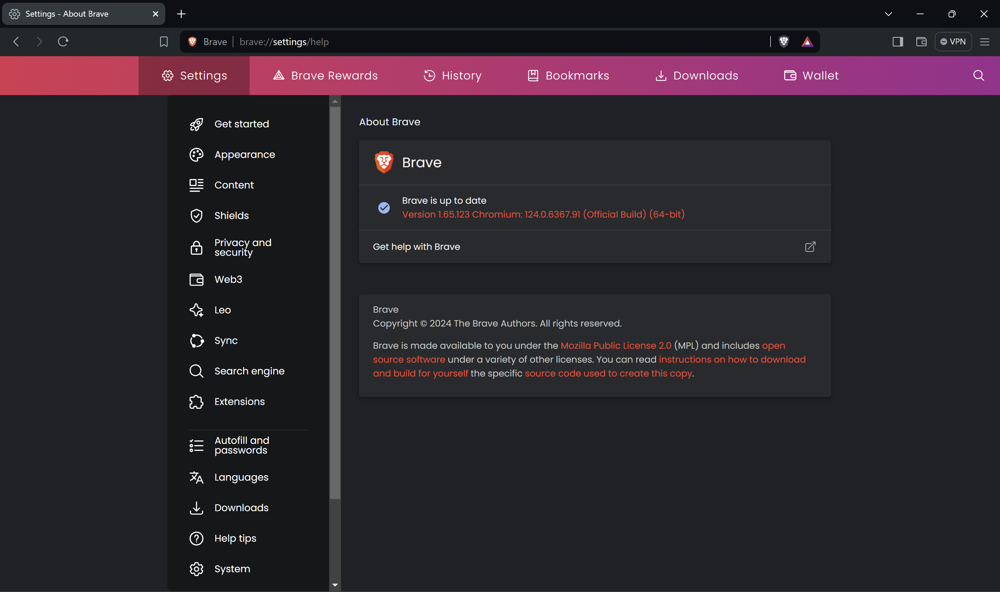
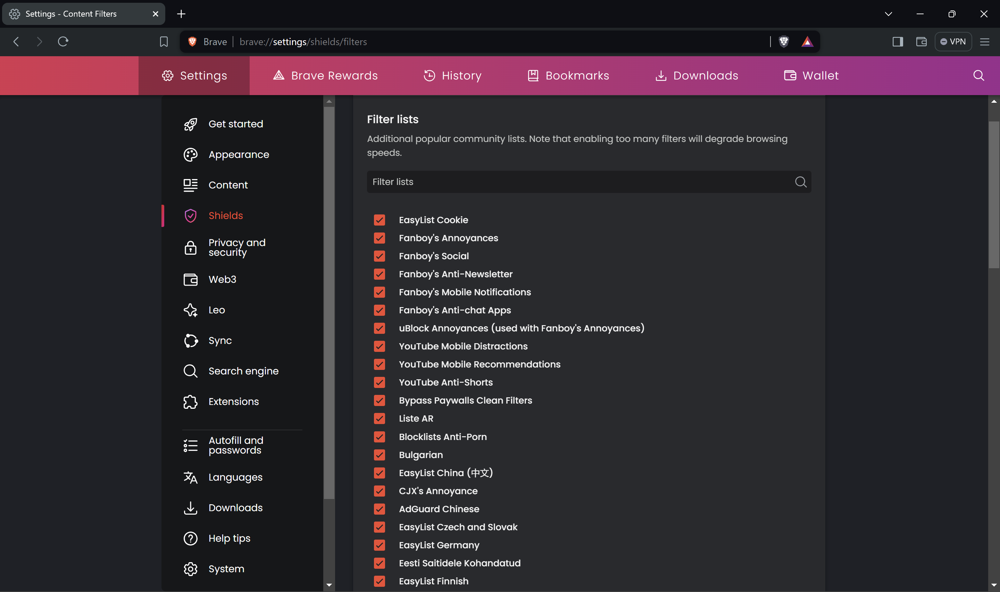
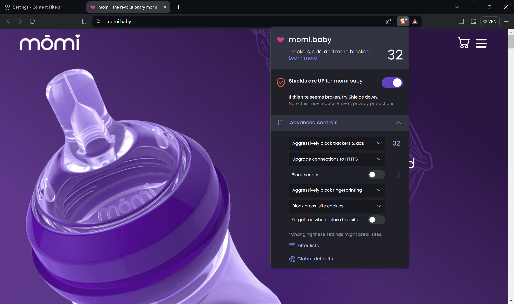
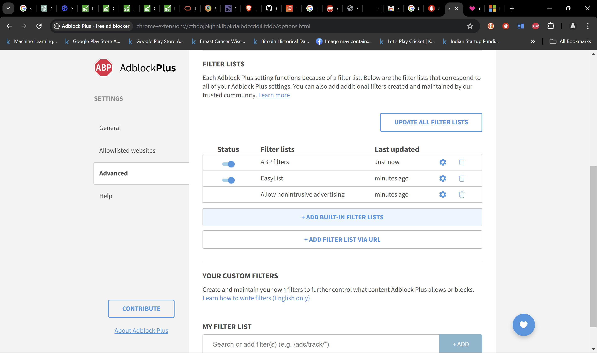

# Wokelo

This project takes up a list of websites and outputs a screenshot of the websites removing any ads, cookies, popups, notifications on the website

## Code Overview

Click on the below image to go to youtube

[](https://www.youtube.com/watch?v=GBwQs7liVvY&ab_channel=DivyanshJain)

## Setup

1. Setup python 3.12 
2. Create a new virtual environment
   
    ```
   # Create env
   python -m venv /path/to/new/virtual/environment
   
   # Activate env
   /path/to/new/virtual/environment activate
   ```

3. Install requirements 
    
    ```
   pip install -r requirements.txt
   ```
   
4. Check your Chrome version
   
   

5. Download ChromeDriver (as per your version)

    ```
   # For old versions
   https://chromedriver.chromium.org/downloads
   
   # For newer versions of Brave
   https://googlechromelabs.github.io/chrome-for-testing/
   ```
   
6. Setup your environment variables (See .env.example file)
   ```
   DRIVER_PATH="C:\Users\divya\PycharmProjects\wokelo\chromedriver.exe"
   BRAVE_PATH="C:\Program Files\BraveSoftware\Brave-Browser\Application\brave.exe"
   USER_DATA_DIR="C:\Users\divya\AppData\Local\BraveSoftware\Brave-Browser\User Data"
   USER_PROFILE="Default"
   ```

7. Run `main.py` file

8. You can see the output images in `images` folder

9. Sample outputs (more sample outputs in the folder)
   
   
   


## How Brave does it?

Brave comes inbuilt with 2 main features

1. Filter Lists
   
2. Shields
   

## Future Work - How to further scale this?

1. Use threads and multiple windows in selenium - Not possible
   1. Multiple selenium drivers with same profile - drivers cannot share the same profile, it gets locked
      ```
      Exception occurred for url https://www.alpha-sense.com/ : Message: unknown error: failed to write prefs file
      ```
   2. Multiple windows with same profile - The window needs to be in focus for which ss is being taken, therefore not possible
2. Use multiple drivers with different profiles - Possible
   1. No of profiles = No of cores on the machine
   2. The profile contains the filter lists configuration, copy and share it in the setup
3. Use Selenium Grid
   1. With selenium grid, its easier to scale the number of instances of the browser
   2. Selenium grid only supports Edge, Chrome and Firefox
   3. Possible ways:
      1. Brave is also based on Chromium, so with a bit of research it should be possible to use brave with Selenium Grid
      2. Use AdBlock Plus with Chrome, it has the features of using custom filter lists
         