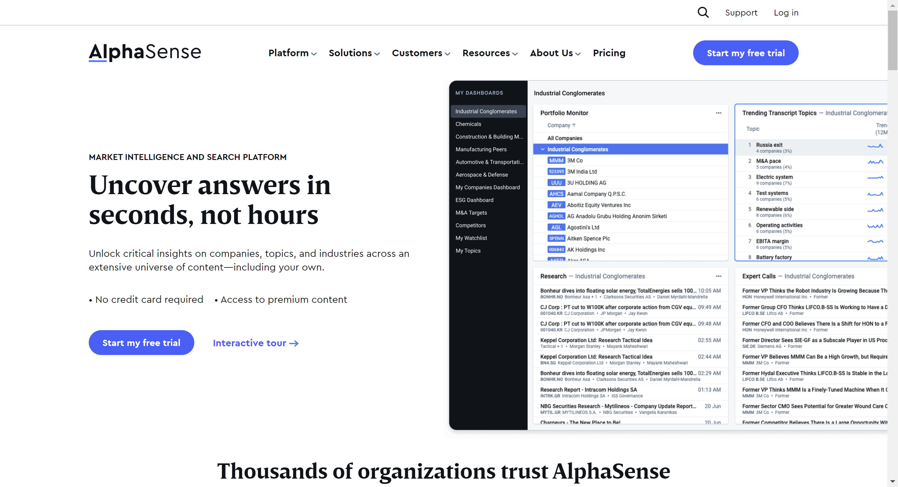

# wokelo

This project takes up a list of websites and outputs a screenshot of the websites removing any ads, cookies, popups, notifications on the website

## setup

1. Setup python 3.12 
2. Create a new virtual environment
   
    ```
   # Create env
   python -m venv /path/to/new/virtual/environment
   
   # Activate env
   /path/to/new/virtual/environment
   ```

3. Install requirements 
    
    ```
   pip install -r requirements.txt
   ```
   
4. Check your Chrome version
   
   

5. Download ChromeDriver (as per your version)

    ```
   # For old versions
   https://chromedriver.chromium.org/downloads
   
   # For newer versions of Chrome
   https://googlechromelabs.github.io/chrome-for-testing/
   ```
   
6. Setup your environment variables (See .env file)
   ```
   DRIVER_PATH = Path to where you have downloaded the chromedriver, be sure to unzip it before setting up this path
   ```

7. Run `main.py` file

8. You can see the output images in `images` folder

9. Sample outputs (more sample outputs in the folder)
   
   
   
